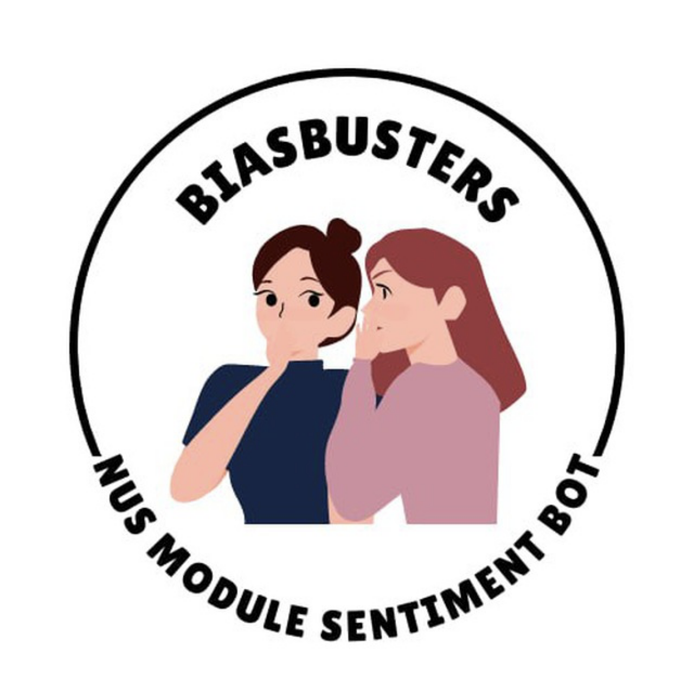
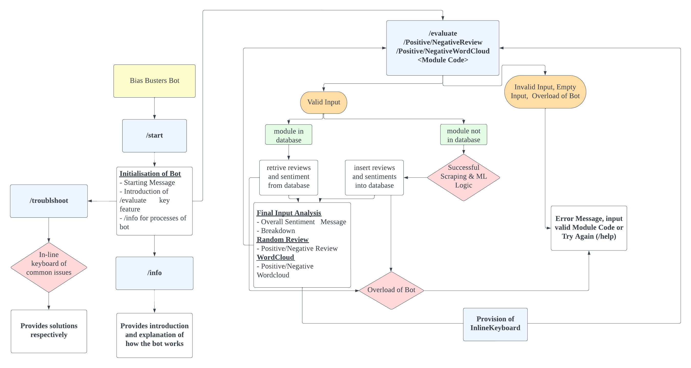

# BiasBusters

Sentiment Analysis telegram bot that gives students the best insights on NUS module based on online reviews &lt;3 

## Installation
1. Clone repository to your local machine:
```bash
git clone https://github.com/hengbl/BiasBusters.git
cd BiasBusters
```
2. Create a virtual environment to isolate our package dependencies locally:
```bash
python -m venv env
source env/bin/activate
```
3. Install all the required packages:
```bash
pip3 install -r requirements.txt
```
4. Set up the necessary environment variables:
Create a `.env` file in the root directory and add the following:
```plaintext
TELE_TOKEN='your_telegram_bot_api_key_here'
MONGO_URL = `your_mongodb_uri`
```
5. To start the Telegram bot, run:
```bash
python run.py
```

## Motivation
Be it incoming freshmen matriculating into NUS or current students, we face uncertainties and questions involving our curriculum. One specific difficulty would be choosing our modules. Apart from pre-assigned modules, we could choose additional modules to clear our unrestricted electives. That poses a question: **What is a good module that we can take up?**

Not everyone has the privilege to consult seniors and friends about the modules, hence the internet becomes a helpful channel to aid us in our decision. I’m sure a lot of students, including us, went through the experience of doing hours of research through all the different avenues available such as NUSMods, Reddit or even blogs. However, with so many irrelevant posts or comments with different sentiments out there, we continue racking our brains over a decision. Furthermore, merely having the opinions of a couple individuals may not be adequate due to potential inherent personal bias. 

This makes us ponder, wouldn’t it be great if there’s a **fast and convenient way to collate all these posts and come up with a general sentiment about a module**, without the hassle of going through each and every one of them? As aspiring data analysts / scientists, we want to make use of Machine Learning and Natural Language Processing to offer a solution that can solve a problem that plagued many of our college peers. This will potentially allow them to make a more informed decision about their modules which are imperative to their college experience.

## User Stories
1. As an incoming freshman or current student who wants to have an overall review of the module I am interested in, I want to see the overall sentiment of the said module quickly and effortlessly. 
2. As a teaching assistant or professor who wishes to understand students’ opinions on a module that they teach, they can access the statistics of the overall sentiments of students regarding that module online. 
3. As a user, I want the bot to be intuitive, and be able to handle commands that may have been an input error
4. As a user, I want to use the bot without being confused
5. As a user, I want the bot to be able to display the commands that I can use
6. As a user, I want to be able to see what reviews the model deemed to be positive or negative to further affirm my opinions

## Bot Flow


## Tech Stack
[![My Tech Stack](https://github-readme-tech-stack.vercel.app/api/cards?lineCount=1&bg=%230D1117&badge=%23161B22&border=%2321262D&titleColor=%2358A6FF&line1=data%3Aimage%2Fsvg%2Bxml%3Bbase64%2CPD94bWwgdmVyc2lvbj0iMS4wIiBlbmNvZGluZz0idXRmLTgiPz48IS0tIFVwbG9hZGVkIHRvOiBTVkcgUmVwbywgd3d3LnN2Z3JlcG8uY29tLCBHZW5lcmF0b3I6IFNWRyBSZXBvIE1peGVyIFRvb2xzIC0tPgo8c3ZnIHdpZHRoPSI4MDBweCIgaGVpZ2h0PSI4MDBweCIgdmlld0JveD0iMCAwIDEwMjQgMTAyNCIgeG1sbnM9Imh0dHA6Ly93d3cudzMub3JnLzIwMDAvc3ZnIj4KICAgPGNpcmNsZSBjeD0iNTEyIiBjeT0iNTEyIiByPSI1MTIiIHN0eWxlPSJmaWxsOiMxM2FhNTIiLz4KICAgPHBhdGggZD0iTTY0OC44NiA0NDkuNDRjLTMyLjM0LTE0Mi43My0xMDguNzctMTg5LjY2LTExNy0yMDcuNTktOS0xMi42NS0xOC4xMi0zNS4xNS0xOC4xMi0zNS4xNS0uMTUtLjM4LS4zOS0xLjA1LS42Ny0xLjctLjkzIDEyLjY1LTEuNDEgMTcuNTMtMTMuMzcgMzAuMjktMTguNTIgMTQuNDgtMTEzLjU0IDk0LjIxLTEyMS4yNyAyNTYuMzctNy4yMSAxNTEuMjQgMTA5LjI1IDI0MS4zNiAxMjUgMjUyLjg1bDEuNzkgMS4yN3YtLjExYy4xLjc2IDUgMzYgOC40NCA3My4zNEg1MjZhNzI2LjY4IDcyNi42OCAwIDAgMSAxMy03OC41M2wxLS42NWEyMDQuNDggMjA0LjQ4IDAgMCAwIDIwLjExLTE2LjQ1bC43Mi0uNjVjMzMuNDgtMzAuOTMgOTMuNjctMTAyLjQ3IDkzLjA4LTIxNi41M2EzNDcuMDcgMzQ3LjA3IDAgMCAwLTUuMDUtNTYuNzZ6TTUxMi4zNSA2NTkuMTJzMC0yMTIuMTIgNy0yMTIuMDhjNS40NiAwIDEyLjUzIDI3My42MSAxMi41MyAyNzMuNjEtOS43Mi0xLjE3LTE5LjUzLTQ1LjAzLTE5LjUzLTYxLjUzeiIgc3R5bGU9ImZpbGw6I2ZmZiIvPgo8L3N2Zz4%3D%2CMongoDB%2C%3Bdata%3Aimage%2Fsvg%2Bxml%3Bbase64%2CPD94bWwgdmVyc2lvbj0iMS4wIiBlbmNvZGluZz0idXRmLTgiPz48IS0tIFVwbG9hZGVkIHRvOiBTVkcgUmVwbywgd3d3LnN2Z3JlcG8uY29tLCBHZW5lcmF0b3I6IFNWRyBSZXBvIE1peGVyIFRvb2xzIC0tPgo8c3ZnIHdpZHRoPSI4MDBweCIgaGVpZ2h0PSI4MDBweCIgdmlld0JveD0iMCAwIDY0IDY0IiBmaWxsPSJub25lIiB4bWxucz0iaHR0cDovL3d3dy53My5vcmcvMjAwMC9zdmciPjxwYXRoIGQ9Ik0zMS44ODUgMTZjLTguMTI0IDAtNy42MTcgMy41MjMtNy42MTcgMy41MjNsLjAxIDMuNjVoNy43NTJ2MS4wOTVIMjEuMTk3UzE2IDIzLjY3OCAxNiAzMS44NzZjMCA4LjE5NiA0LjUzNyA3LjkwNiA0LjUzNyA3LjkwNmgyLjcwOHYtMy44MDRzLS4xNDYtNC41MzcgNC40NjUtNC41MzdoNy42ODhzNC4zMi4wNyA0LjMyLTQuMTc1di03LjAxOVM0MC4zNzQgMTYgMzEuODg1IDE2em0tNC4yNzUgMi40NTRjLjc3MSAwIDEuMzk1LjYyNCAxLjM5NSAxLjM5NXMtLjYyNCAxLjM5NS0xLjM5NSAxLjM5NWExLjM5MyAxLjM5MyAwIDAgMS0xLjM5NS0xLjM5NWMwLS43NzEuNjI0LTEuMzk1IDEuMzk1LTEuMzk1eiIgZmlsbD0idXJsKCNhKSIvPjxwYXRoIGQ9Ik0zMi4xMTUgNDcuODMzYzguMTI0IDAgNy42MTctMy41MjMgNy42MTctMy41MjNsLS4wMS0zLjY1SDMxLjk3di0xLjA5NWgxMC44MzJTNDggNDAuMTU1IDQ4IDMxLjk1OGMwLTguMTk3LTQuNTM3LTcuOTA2LTQuNTM3LTcuOTA2aC0yLjcwOHYzLjgwM3MuMTQ2IDQuNTM3LTQuNDY1IDQuNTM3aC03LjY4OHMtNC4zMi0uMDctNC4zMiA0LjE3NXY3LjAxOXMtLjY1NiA0LjI0NyA3LjgzMyA0LjI0N3ptNC4yNzUtMi40NTRhMS4zOTMgMS4zOTMgMCAwIDEtMS4zOTUtMS4zOTVjMC0uNzcuNjI0LTEuMzk0IDEuMzk1LTEuMzk0czEuMzk1LjYyMyAxLjM5NSAxLjM5NGMwIC43NzItLjYyNCAxLjM5NS0xLjM5NSAxLjM5NXoiIGZpbGw9InVybCgjYikiLz48ZGVmcz48bGluZWFyR3JhZGllbnQgaWQ9ImEiIHgxPSIxOS4wNzUiIHkxPSIxOC43ODIiIHgyPSIzNC44OTgiIHkyPSIzNC42NTgiIGdyYWRpZW50VW5pdHM9InVzZXJTcGFjZU9uVXNlIj48c3RvcCBzdG9wLWNvbG9yPSIjMzg3RUI4Ii8%2BPHN0b3Agb2Zmc2V0PSIxIiBzdG9wLWNvbG9yPSIjMzY2OTk0Ii8%2BPC9saW5lYXJHcmFkaWVudD48bGluZWFyR3JhZGllbnQgaWQ9ImIiIHgxPSIyOC44MDkiIHkxPSIyOC44ODIiIHgyPSI0NS44MDMiIHkyPSI0NS4xNjMiIGdyYWRpZW50VW5pdHM9InVzZXJTcGFjZU9uVXNlIj48c3RvcCBzdG9wLWNvbG9yPSIjRkZFMDUyIi8%2BPHN0b3Agb2Zmc2V0PSIxIiBzdG9wLWNvbG9yPSIjRkZDMzMxIi8%2BPC9saW5lYXJHcmFkaWVudD48L2RlZnM%2BPC9zdmc%2B%2Cpython%2C%3Bdata%3Aimage%2Fsvg%2Bxml%3Bbase64%2CPD94bWwgdmVyc2lvbj0iMS4wIiBlbmNvZGluZz0iVVRGLTgiIHN0YW5kYWxvbmU9Im5vIj8%2BCjwhLS0gR2VuZXJhdG9yOiBBZG9iZSBJbGx1c3RyYXRvciAxNC4wLjAsIFNWRyBFeHBvcnQgUGx1Zy1JbiAuIFNWRyBWZXJzaW9uOiA2LjAwIEJ1aWxkIDQzMzYzKSAgLS0%2BCgo8c3ZnCiAgIHhtbG5zOmRjPSJodHRwOi8vcHVybC5vcmcvZGMvZWxlbWVudHMvMS4xLyIKICAgeG1sbnM6Y2M9Imh0dHA6Ly9jcmVhdGl2ZWNvbW1vbnMub3JnL25zIyIKICAgeG1sbnM6cmRmPSJodHRwOi8vd3d3LnczLm9yZy8xOTk5LzAyLzIyLXJkZi1zeW50YXgtbnMjIgogICB4bWxuczpzdmc9Imh0dHA6Ly93d3cudzMub3JnLzIwMDAvc3ZnIgogICB4bWxucz0iaHR0cDovL3d3dy53My5vcmcvMjAwMC9zdmciCiAgIHhtbG5zOnNvZGlwb2RpPSJodHRwOi8vc29kaXBvZGkuc291cmNlZm9yZ2UubmV0L0RURC9zb2RpcG9kaS0wLmR0ZCIKICAgeG1sbnM6aW5rc2NhcGU9Imh0dHA6Ly93d3cuaW5rc2NhcGUub3JnL25hbWVzcGFjZXMvaW5rc2NhcGUiCiAgIHZlcnNpb249IjEuMSIKICAgaWQ9IkxheWVyXzEiCiAgIHg9IjBweCIKICAgeT0iMHB4IgogICB3aWR0aD0iNzMuMzc0MDg0bW0iCiAgIGhlaWdodD0iMzkuNTcwNzYzbW0iCiAgIHZpZXdCb3g9IjAgMCAyNzcuMzE5MzcgMTQ5LjU1ODc5IgogICBlbmFibGUtYmFja2dyb3VuZD0ibmV3IDAgMCA3OTIgNjEyIgogICB4bWw6c3BhY2U9InByZXNlcnZlIgogICBpbmtzY2FwZTp2ZXJzaW9uPSIwLjkyLjMgKDI0MDU1NDYsIDIwMTgtMDMtMTEpIgogICBzb2RpcG9kaTpkb2NuYW1lPSJzY2lraXQgbGVhcm4gbG9nbyBzbWFsbC5zdmciPjxtZXRhZGF0YQogICBpZD0ibWV0YWRhdGEzNSI%2BPHJkZjpSREY%2BPGNjOldvcmsKICAgICAgIHJkZjphYm91dD0iIj48ZGM6Zm9ybWF0PmltYWdlL3N2Zyt4bWw8L2RjOmZvcm1hdD48ZGM6dHlwZQogICAgICAgICByZGY6cmVzb3VyY2U9Imh0dHA6Ly9wdXJsLm9yZy9kYy9kY21pdHlwZS9TdGlsbEltYWdlIiAvPjxkYzp0aXRsZT48L2RjOnRpdGxlPjwvY2M6V29yaz48L3JkZjpSREY%2BPC9tZXRhZGF0YT48ZGVmcwogICBpZD0iZGVmczMzIiAvPjxzb2RpcG9kaTpuYW1lZHZpZXcKICAgcGFnZWNvbG9yPSIjZmZmZmZmIgogICBib3JkZXJjb2xvcj0iIzY2NjY2NiIKICAgYm9yZGVyb3BhY2l0eT0iMSIKICAgb2JqZWN0dG9sZXJhbmNlPSIxMCIKICAgZ3JpZHRvbGVyYW5jZT0iMTAiCiAgIGd1aWRldG9sZXJhbmNlPSIxMCIKICAgaW5rc2NhcGU6cGFnZW9wYWNpdHk9IjAiCiAgIGlua3NjYXBlOnBhZ2VzaGFkb3c9IjIiCiAgIGlua3NjYXBlOndpbmRvdy13aWR0aD0iNzc3IgogICBpbmtzY2FwZTp3aW5kb3ctaGVpZ2h0PSI2MjYiCiAgIGlkPSJuYW1lZHZpZXczMSIKICAgc2hvd2dyaWQ9ImZhbHNlIgogICBpbmtzY2FwZTp6b29tPSIxLjA5MDcwMDciCiAgIGlua3NjYXBlOmN4PSIxMjEuNjg4NCIKICAgaW5rc2NhcGU6Y3k9Ijc5LjQ5MjI5IgogICBpbmtzY2FwZTp3aW5kb3cteD0iMjk1MSIKICAgaW5rc2NhcGU6d2luZG93LXk9IjY3OSIKICAgaW5rc2NhcGU6d2luZG93LW1heGltaXplZD0iMCIKICAgaW5rc2NhcGU6Y3VycmVudC1sYXllcj0iTGF5ZXJfMSIKICAgdW5pdHM9Im1tIgogICBzaG93Ym9yZGVyPSJ0cnVlIgogICBmaXQtbWFyZ2luLXRvcD0iMCIKICAgZml0LW1hcmdpbi1sZWZ0PSIwIgogICBmaXQtbWFyZ2luLXJpZ2h0PSIwIgogICBmaXQtbWFyZ2luLWJvdHRvbT0iMCIgLz4KPGcKICAgaWQ9ImczIgogICB0cmFuc2Zvcm09InRyYW5zbGF0ZSgtMTIwLjYwODYxLC0yMjAuMjYwMTcpIj4KCTxwYXRoCiAgIGQ9Im0gMzMzLjMyLDM0Ny4zNDggYyAzMy44NjksLTMzLjg2NyAzOS40OTgsLTgzLjE0NiAxMi41NzIsLTExMC4wNyAtMjYuOTIyLC0yNi45MjEgLTc2LjE5OSwtMjEuMjkzIC0xMTAuMDY2LDEyLjU3MiAtMzMuODY3LDMzLjg2NiAtMjQuMDcsOTguNTY4IC0xMi41NywxMTAuMDcgOS4yOTMsOS4yOTMgNzYuMTk5LDIxLjI5MyAxMTAuMDY0LC0xMi41NzIgeiIKICAgaWQ9InBhdGg1IgogICBpbmtzY2FwZTpjb25uZWN0b3ItY3VydmF0dXJlPSIwIgogICBzdHlsZT0iZmlsbDojZjg5OTM5IiAvPgoJPHBhdGgKICAgZD0ibSAxOTQuMzUsMjk4LjQxMSBjIC0xOS42NDgsLTE5LjY0OCAtNDguMjQyLC0yMi45MTkgLTYzLjg2NywtNy4yOTUgLTE1LjYyMSwxNS42MjIgLTEyLjM1NSw0NC4yMiA3LjI5Nyw2My44NjUgMTkuNjUyLDE5LjY1NCA1Ny4xOTUsMTMuOTY5IDYzLjg2Myw3LjI5NSA1LjM5NiwtNS4zODcgMTIuMzYxLC00NC4yMTUgLTcuMjkzLC02My44NjUgeiIKICAgaWQ9InBhdGg3IgogICBpbmtzY2FwZTpjb25uZWN0b3ItY3VydmF0dXJlPSIwIgogICBzdHlsZT0iZmlsbDojMzQ5OWNkIiAvPgo8L2c%2BCjxnCiAgIGlkPSJnOSIKICAgdHJhbnNmb3JtPSJ0cmFuc2xhdGUoLTEyMC42MDg2MSwtMjIwLjI2MDE3KSI%2BCgk8ZwogICBpZD0iZzExIj4KCQk8cGF0aAogICBkPSJtIDI2Mi4xNDMsMzM5LjA0NyBjIC0zLjQ3MSwzLjE5NSAtNi41MTYsNS41NTMgLTkuMTMzLDcuMDY4IC0yLjYxNywxLjUyIC01LjExMywyLjI3OSAtNy40ODgsMi4yNzkgLTIuNzMyLDAgLTQuOTM2LC0xLjA1OSAtNi42MDcsLTMuMTc4IC0xLjY3NCwtMi4xMjEgLTIuNTA4LC00Ljk2NSAtMi41MDgsLTguNTQzIDAsLTUuMzYxIDEuMTYyLC0xMS43OTcgMy40ODYsLTE5LjMwMSAyLjMyLC03LjUxIDUuMTQ1LC0xNC40MyA4LjQ2MywtMjAuNzYxIGwgOS43MjksLTMuNjAyIGMgMC4zMDUsLTAuMTAyIDAuNTM3LC0wLjE1NCAwLjY5MSwtMC4xNTQgMC43MzgsMCAxLjM0OCwwLjU0NCAxLjgxNiwxLjYyNyAwLjQ3MywxLjA4OCAwLjcxMSwyLjU1IDAuNzExLDQuMzg4IDAsNS4yMDkgLTEuMTk5LDEwLjI1MiAtMy42MDIsMTUuMTI5IC0yLjQwMiw0Ljg3OSAtNi4xNTQsMTAuMDg2IC0xMS4yNiwxNS42MjcgLTAuMjA1LDIuNjU2IC0wLjMwNyw0LjQ4IC0wLjMwNyw1LjQ3NyAwLDIuMjIzIDAuNDA4LDMuOTgyIDEuMjI1LDUuMjg1IDAuODE4LDEuMzA1IDEuOTAyLDEuOTUzIDMuMjU2LDEuOTUzIDEuMzgxLDAgMi44NDgsLTAuNDk0IDQuNDA2LC0xLjQ5IDEuNTU1LC0wLjk5OCAzLjkzLC0zLjA2NCA3LjEyMSwtNi4yMDcgdiA0LjQwMyB6IG0gLTE0LjY2OCwtMTQuOTczIGMgMy4yNDIsLTMuNjA1IDUuODc1LC03LjY0OCA3Ljg5MSwtMTIuMTIxIDIuMDE2LC00LjQ3NSAzLjAyMywtOC4zMjQgMy4wMjMsLTExLjU0OSAwLC0wLjk0IC0wLjEzOSwtMS43MDQgLTAuNDE4LC0yLjI3OCAtMC4yODEsLTAuNTc1IC0wLjY0MSwtMC44NjQgLTEuMDc0LC0wLjg2NCAtMC45NDEsMCAtMi4zMTYsMi4zNTIgLTQuMTE3LDcuMDU3IC0xLjgwMSw0LjcwNCAtMy41NjksMTEuMjkgLTUuMzA1LDE5Ljc1NSB6IgogICBpZD0icGF0aDEzIgogICBpbmtzY2FwZTpjb25uZWN0b3ItY3VydmF0dXJlPSIwIgogICBzdHlsZT0iZmlsbDojMDEwMTAxIiAvPgoJCTxwYXRoCiAgIGQ9Im0gMjkwLjc5NSwzMzkuMDQ3IGMgLTMuMjQyLDMuMTk1IC02LjE1Miw1LjU1MyAtOC43MzIsNy4wNjggLTIuNTgsMS41MiAtNS40MjQsMi4yNzkgLTguNTQxLDIuMjc5IC0zLjQ3MywwIC02LjI3NSwtMS4xMTEgLTguNDEsLTMuMzMgLTIuMTMxLC0yLjIyNSAtMy4xOTUsLTUuMTQ2IC0zLjE5NSwtOC43NzMgMCwtNS40MTIgMS44NzUsLTEwLjMwOSA1LjYzMywtMTQuNjg4IDMuNzUsLTQuMzgxIDcuOTE0LC02LjU3IDEyLjQ4NCwtNi41NyAyLjM3NSwwIDQuMjc1LDAuNjE1IDUuNzA3LDEuODQgMS40MywxLjIyNyAyLjE0NSwyLjgzNCAyLjE0NSw0LjgyNiAwLDUuMjg3IC01LjYxNyw5LjU3NCAtMTYuODUyLDEyLjg2OSAxLjAyLDQuOTc3IDMuNjg4LDcuNDY5IDguMDA0LDcuNDY5IDEuNjg2LDAgMy4yOTMsLTAuNDUzIDQuODI0LC0xLjM1NyAxLjUzNSwtMC45MDggMy44NDQsLTIuOTIyIDYuOTM0LC02LjAzNSB2IDQuNDAyIHogbSAtMjAuMDcsLTcuMDg0IGMgNi41MzUsLTEuODQgOS44MDUsLTUuMjM0IDkuODA1LC0xMC4xODggMCwtMi40NTEgLTAuODk1LC0zLjY3NiAtMi42OCwtMy42NzYgLTEuNjg2LDAgLTMuMjkzLDEuMjgxIC00LjgyNCwzLjg1IC0xLjUzNiwyLjU2NSAtMi4zMDEsNS45MDEgLTIuMzAxLDEwLjAxNCB6IgogICBpZD0icGF0aDE1IgogICBpbmtzY2FwZTpjb25uZWN0b3ItY3VydmF0dXJlPSIwIgogICBzdHlsZT0iZmlsbDojMDEwMTAxIiAvPgoJCTxwYXRoCiAgIGQ9Im0gMzMxLjcwMSwzMzkuMDQ3IGMgLTQuMDg2LDMuODgxIC03LjAxLDYuNDEyIC04Ljc3LDcuNTg4IC0xLjc2MiwxLjE3NCAtMy40NDcsMS43NiAtNS4wNTcsMS43NiAtNC4wMzUsMCAtNS45MzYsLTMuNTYxIC01LjcwNywtMTAuNjg2IC0yLjU1MywzLjY1IC00LjkxLDYuMzQ0IC03LjA2OCw4LjA4NCAtMi4xNTYsMS43MzYgLTQuMzgzLDIuNjAyIC02LjY4NCwyLjYwMiAtMi4yNDQsMCAtNC4xNTIsLTEuMDUxIC01LjcyNSwtMy4xNTggLTEuNTczLC0yLjEwNyAtMi4zNTQsLTQuNjkxIC0yLjM1NCwtNy43NTggMCwtMy44MjggMS4wNTEsLTcuNDggMy4xNTYsLTEwLjk1NSAyLjEwOSwtMy40NzMgNC44MDksLTYuMjc5IDguMTAyLC04LjQyNCAzLjI5MywtMi4xNDUgNi4yMDcsLTMuMjE5IDguNzMyLC0zLjIxOSAzLjE5MywwIDUuNDI4LDEuNDY5IDYuNzA1LDQuNDA0IGwgNy44MjgsLTQuMzI2IGggMi4xNDggbCAtMy4zODEsMTEuMjIxIGMgLTEuNzM2LDUuNjQ1IC0yLjYwNyw5LjUxNCAtMi42MDcsMTEuNjA3IDAsMi4xOTUgMC43NzcsMy4yOTMgMi4zMzYsMy4yOTMgMC45OTIsMCAyLjA5LC0wLjUyOSAzLjI5MSwtMS41OSAxLjIwMSwtMS4wNjEgMi44ODMsLTIuNjc2IDUuMDUzLC00Ljg0NiB2IDQuNDAzIHogbSAtMjguMDM3LDIuMTA5IGMgMi41NTMsMCA0Ljk1OSwtMi4xNzYgNy4yMjMsLTYuNTI5IDIuMjYsLTQuMzU1IDMuMzg5LC04LjM3MyAzLjM4OSwtMTIuMDQ5IDAsLTEuNDI4IC0wLjMyMiwtMi41NDcgLTAuOTU3LC0zLjM1IC0wLjY0MSwtMC44MDcgLTEuNDk2LC0xLjIwNyAtMi41NjYsLTEuMjA3IC0yLjU1NSwwIC00Ljk3NywyLjE3IC03LjI1OCw2LjUxMiAtMi4yODUsNC4zNDIgLTMuNDMsOC4zMzggLTMuNDMsMTEuOTg2IDAsMS4zODEgMC4zNCwyLjQ5OCAxLjAxNiwzLjM1NCAwLjY3NiwwLjg1NiAxLjUzNCwxLjI4MyAyLjU4MywxLjI4MyB6IgogICBpZD0icGF0aDE3IgogICBpbmtzY2FwZTpjb25uZWN0b3ItY3VydmF0dXJlPSIwIgogICBzdHlsZT0iZmlsbDojMDEwMTAxIiAvPgoJCTxwYXRoCiAgIGQ9Im0gMzYwLjMxNCwzMzkuMDQ3IGMgLTYuNDEsNi4yODEgLTExLjM1Miw5LjQyNCAtMTQuODI0LDkuNDI0IC0xLjU1OSwwIC0yLjg3NSwtMC42NTggLTMuOTQ1LC0xLjk2OSAtMS4wNywtMS4zMTYgLTEuNjA5LC0yLjk0NSAtMS42MDksLTQuODg3IDAsLTMuNiAxLjkzLC04LjQyNCA1Ljc4NSwtMTQuNDc3IC0xLjg5MSwwLjk3MSAtMy45NTcsMS42NDUgLTYuMjA1LDIuMDI5IC0xLjY2LDMuMDY0IC00LjI2Niw2LjM1OSAtNy44MTQsOS44NzkgaCAtMC44NzkgdiAtMy40NDMgYyAxLjk5LC0yLjA2OCAzLjc5MSwtNC4yOTEgNS40LC02LjY2NiAtMi4xOTksLTAuOTcxIC0zLjI5NSwtMi40MTQgLTMuMjk1LC00LjMyNiAwLC0xLjk2OSAwLjY2OCwtNC4wNjggMi4wMTIsLTYuMzA1IDEuMzQsLTIuMjMyIDMuMTg0LC0zLjM0OCA1LjUzNSwtMy4zNDggMS45OTIsMCAyLjk4NiwxLjAxOCAyLjk4NiwzLjA2MiAwLDEuNjA5IC0wLjU3NCwzLjkwNiAtMS43MjUsNi44OTUgNC4yMzgsLTAuNDYxIDcuOTQxLC0zLjcwMSAxMS4xMDksLTkuNzI5IGwgMy40ODQsLTAuMTU0IC0zLjU2Miw5LjgwNSBjIC0xLjQ4LDQuMTM3IC0yLjQzOCw2Ljk1NSAtMi44NzEsOC40NDcgLTAuNDMzLDEuNDkyIC0wLjY1MiwyLjgxNiAtMC42NTIsMy45NjMgMCwxLjA3NCAwLjI1LDEuOTMyIDAuNzQ2LDIuNTY2IDAuNDk4LDAuNjQzIDEuMTcsMC45NTkgMi4wMTIsMC45NTkgMC45MTgsMCAxLjgwMSwtMC4zMTQgMi42NDMsLTAuOTM2IDAuODQyLC0wLjYzMSAyLjczMiwtMi4zNTkgNS42NywtNS4xOTMgdiA0LjQwNCB6IgogICBpZD0icGF0aDE5IgogICBpbmtzY2FwZTpjb25uZWN0b3ItY3VydmF0dXJlPSIwIgogICBzdHlsZT0iZmlsbDojMDEwMTAxIiAvPgoJCTxwYXRoCiAgIGQ9Im0gMzk3LjkyOCwzMzkuMDQ3IGMgLTUuODk4LDYuMjM0IC0xMC45NTcsOS4zNDggLTE1LjE2OCw5LjM0OCAtMS43MTEsMCAtMy4wOSwtMC42IC00LjEzNywtMS44MDEgLTEuMDQ5LC0xLjE5OSAtMS41NzIsLTIuODA3IC0xLjU3MiwtNC44MjQgMCwtMi43MzIgMS4xMjUsLTYuOTA4IDMuMzczLC0xMi41MjMgMS4xOTksLTMuMDE0IDEuODAxLC00LjkzMiAxLjgwMSwtNS43NDYgMCwtMC44MTggLTAuMzIyLC0xLjIyNyAtMC45NTcsLTEuMjI3IC0wLjM1NywwIC0wLjgzMiwwLjE4IC0xLjQxOCwwLjUzNSAtMC41MzksMC4zNTcgLTEuMTY0LDAuODU5IC0xLjg3OSwxLjQ5NiAtMC42MzcsMC41ODYgLTEuMzU0LDEuMzAxIC0yLjE0NSwyLjE0MSAtMC42OTEsMC43MjEgLTEuNDMyLDEuNTM3IC0yLjIxOSwyLjQ1MyBsIC0yLjE0OCwyLjQ5MiBjIC0wLjk0MywxLjE0OCAtMS41MzEsMi4zNTkgLTEuNzYsMy42MzcgLTAuMzg1LDIuMTcgLTAuNjM5LDQuMTY0IC0wLjc2OCw1Ljk3OSAtMC4wNzgsMS4zNSAtMC4xMTUsMy4xNzQgLTAuMTE1LDUuNDc3IGwgLTguNDY1LDEuOTg4IGMgLTAuMjc5LC0zLjQ0NyAtMC40MjIsLTYuMDE0IC0wLjQyMiwtNy42OTcgMCwtNC4xMTEgMC40NzksLTguMDA2IDEuNDM4LC0xMS42ODIgMC45NTcsLTMuNjggMi40OTQsLTcuODE0IDQuNjE1LC0xMi40MTIgbCA5LjM0NCwtMS43OTkgYyAtMS45NjUsNS4yODcgLTMuMjU0LDkuNDQ3IC0zLjg2NywxMi40ODQgNC4xODgsLTQuNjcyIDcuNTA4LC03LjkwNiA5Ljk2OSwtOS43MDkgMi40NTcsLTEuODAxIDQuNjQ1LC0yLjY5NyA2LjU1NywtMi42OTcgMS4yOTksMCAyLjM4NSwwLjQ5IDMuMjUsMS40NzEgMC44NjksMC45ODIgMS4zMDEsMi4yMTUgMS4zMDEsMy42ODkgMCwyLjQ0OSAtMS4wOTgsNi40ODQgLTMuMjkxLDEyLjEwNCAtMS41MDgsMy44NTQgLTIuMjYyLDYuMzU1IC0yLjI2Miw3LjUxIDAsMS41MzcgMC42MjcsMi4zMDUgMS44ODEsMi4zMDUgMS44NjcsMCA0Ljg5MSwtMi40NjUgOS4wNjQsLTcuMzkzIHoiCiAgIGlkPSJwYXRoMjEiCiAgIGlua3NjYXBlOmNvbm5lY3Rvci1jdXJ2YXR1cmU9IjAiCiAgIHN0eWxlPSJmaWxsOiMwMTAxMDEiIC8%2BCgk8L2c%2BCjwvZz4KCjx0ZXh0CiAgIGZvbnQtc2l6ZT0iMjMuMDc5NSIKICAgaWQ9InRleHQyNSIKICAgc3R5bGU9ImZvbnQtc2l6ZToyMy4wNzk1MDAycHg7bGluZS1oZWlnaHQ6MCU7Zm9udC1mYW1pbHk6SGVsdmV0aWNhO2ZpbGw6I2ZmZmZmZiIKICAgeD0iMTUzLjMzMjc5IgogICB5PSI4MS45NDU5MzgiPnNjaWtpdDwvdGV4dD4KCgoKCgoKPC9zdmc%2B%2CScikit-Learn%2C%3Bdata%3Aimage%2Fsvg%2Bxml%3Bbase64%2CPD94bWwgdmVyc2lvbj0iMS4wIiBlbmNvZGluZz0iVVRGLTgiPz4KPCEtLSBVcGxvYWRlZCB0bzogU1ZHIFJlcG8sIHd3dy5zdmdyZXBvLmNvbSwgR2VuZXJhdG9yOiBTVkcgUmVwbyBNaXhlciBUb29scyAtLT4KPHN2ZyB3aWR0aD0iODAwcHgiIGhlaWdodD0iODAwcHgiIHZpZXdCb3g9Ii05IDAgMjc0IDI3NCIgdmVyc2lvbj0iMS4xIiB4bWxucz0iaHR0cDovL3d3dy53My5vcmcvMjAwMC9zdmciIHhtbG5zOnhsaW5rPSJodHRwOi8vd3d3LnczLm9yZy8xOTk5L3hsaW5rIiBwcmVzZXJ2ZUFzcGVjdFJhdGlvPSJ4TWlkWU1pZCI%2BCgkJPGc%2BCgkJCQk8cGF0aCBkPSJNMTQ1LjcyNjA4MSw0Mi4wNjUxOTQ2IEwxNDUuNzI2MDgxLDg0LjEzNDc0MTkgTDIxOC41ODY5NTIsMTI2LjIwNDMxMiBMMjE4LjU4Njk1Miw4NC4xMzQ3NDE5IEwxNDUuNzI2MDgxLDQyLjA2NTE5NDYgWiBNLTEuOTg3MjY0NTRlLTA3LDg0LjEzNDc0MTkgTC0xLjk4NzI2NDU0ZS0wNywxMjYuMjA0MzEyIEwzNi40MzA0MjM4LDE0Ny4yMzQ3NTUgTDM2LjQzMDQyMzgsMTA1LjE2OTUyNyBMLTEuOTg3MjY0NTRlLTA3LDg0LjEzNDc0MTkgWiBNMTA5LjI5MTI5NCwxMDUuMTY5NTI3IEw3Mi44NjA4NzAxLDEyNi4yMDQzMTIgTDcyLjg2MDg3MDEsMjUyLjQwNDMxNiBMMTA5LjI5MTI5NCwyNzMuNDM5MTAxIEwxMDkuMjkxMjk0LDE4OS4zMDQzMDMgTDE0NS43MjYwODEsMjEwLjMzOTA4OCBMMTQ1LjcyNjA4MSwxNjguMjY5NTQgTDEwOS4yOTEyOTQsMTQ3LjIzNDc1NSBMMTA5LjI5MTI5NCwxMDUuMTY5NTI3IFoiIGZpbGw9IiNFNTVCMkQiPgoNPC9wYXRoPgoJCQkJPHBhdGggZD0iTTE0NS43MjYwODEsNDIuMDY1MTk0NiBMMzYuNDMwNDIzOCwxMDUuMTY5NTI3IEwzNi40MzA0MjM4LDE0Ny4yMzQ3NTUgTDEwOS4yOTEyOTQsMTA1LjE2OTUyNyBMMTA5LjI5MTI5NCwxNDcuMjM0NzU1IEwxNDUuNzI2MDgxLDEyNi4yMDQzMTIgTDE0NS43MjYwODEsNDIuMDY1MTk0NiBaIE0yNTUuMDIxNzE3LDYzLjA5OTk3OTQgTDIxOC41ODY5NTIsODQuMTM0NzQxOSBMMjE4LjU4Njk1MiwxMjYuMjA0MzEyIEwyNTUuMDIxNzE3LDEwNS4xNjk1MjcgTDI1NS4wMjE3MTcsNjMuMDk5OTc5NCBaIE0xODIuMTU2NTA1LDE0Ny4yMzQ3NTUgTDE0NS43MjYwODEsMTY4LjI2OTU0IEwxNDUuNzI2MDgxLDIxMC4zMzkwODggTDE4Mi4xNTY1MDUsMTg5LjMwNDMwMyBMMTgyLjE1NjUwNSwxNDcuMjM0NzU1IFogTTE0NS43MjYwODEsMjEwLjMzOTA4OCBMMTA5LjI5MTI5NCwxODkuMzA0MzAzIEwxMDkuMjkxMjk0LDI3My40MzkxMDEgTDE0NS43MjYwODEsMjUyLjQwNDMxNiBMMTQ1LjcyNjA4MSwyMTAuMzM5MDg4IFoiIGZpbGw9IiNFRDhFMjQiPgoNPC9wYXRoPgoJCQkJPHBhdGggZD0iTTE0NS43MjYwODEsLTMuNDE4NjQyODhlLTA1IEwtMS45ODcyNjQ1NGUtMDcsODQuMTM0NzQxOSBMMzYuNDMwNDIzOCwxMDUuMTY5NTI3IEwxNDUuNzI2MDgxLDQyLjA2NTE5NDYgTDIxOC41ODY5NTIsODQuMTM0NzQxOSBMMjU1LjAyMTcxNyw2My4wOTk5Nzk0IEwxNDUuNzI2MDgxLC0zLjQxODY0Mjg4ZS0wNSBaIE0xNDUuNzI2MDgxLDEyNi4yMDQzMTIgTDEwOS4yOTEyOTQsMTQ3LjIzNDc1NSBMMTQ1LjcyNjA4MSwxNjguMjY5NTQgTDE4Mi4xNTY1MDUsMTQ3LjIzNDc1NSBMMTQ1LjcyNjA4MSwxMjYuMjA0MzEyIFoiIGZpbGw9IiNGOEJGM0MiPgoNPC9wYXRoPgoJCTwvZz4KPC9zdmc%2B%2Ctensor+flow%2C%3B)

## Documentation
- See our full documentation and report [here](https://docs.google.com/document/d/1oEJ0yzHoCiJSVWkN6aBg4_yyP9agPJLlX_myntL60oU/edit?usp=sharing).
- See our demo video [here](https://drive.google.com/file/d/176iT__R4OvdXzZmzGBxateXnvpLJjSdC/view?usp=sharing).
